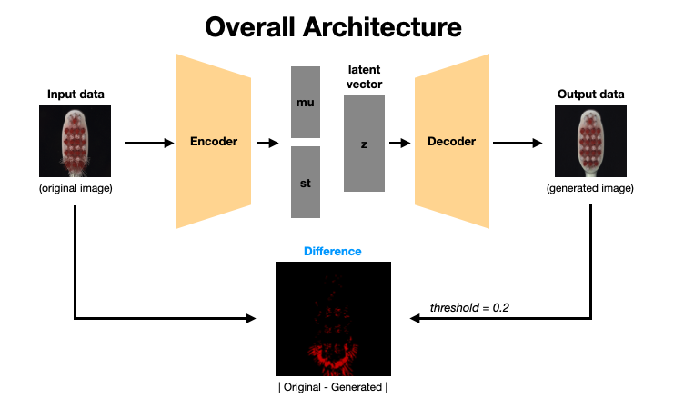
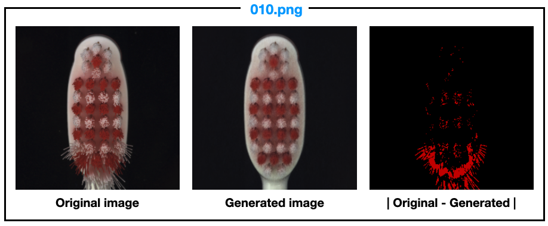
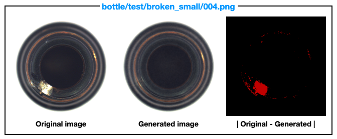
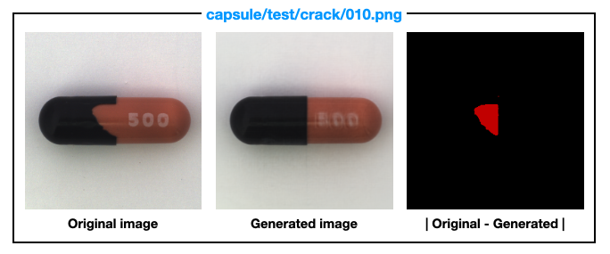

```
Course Project of CSE545 Advanced Computer Vision, UNIST
```

*Skeleton codes were provided by Prof. Baek

## Anormaly Detection

### Prepare data

1. Download the dataset from this [link](https://www.mvtec.com/company/research/datasets/mvtec-ad). You can select and download each object. 

2. ```
   mkdir datasets
   cd datasets
   ```

3. Move the downloaded dataset to this location.

4. ```
   tar -xvf [file_name].tar.xz
   ```


### Execution Method

1. first, install all necessary packages to run

```shell
pip install -r requirements.txt
```

2. In `script` folder, you can see shell file. Also, you can run file using `train.sh` or `test.sh`.

```shell
sh train.sh
```

```shell
sh test.sh
```

3. When excuting the shell file, modify the argument such as path.

```shell
optional arguments:
  -h, --help            show this help message and exit
  --dataset {toothbrush,bottle,capsule}
  --dataroot DATAROOT
  --mode {train,test/defective,test/poke,test/squeeze,test/broken_large,test/broken_small,test/contamination,test/crack}
  --seed SEED
  --epochs EPOCHS
  --batch_size BATCH_SIZE
  --lr LR
  --constant CONSTANT   constant for loss
  --weight_path WEIGHT_PATH
                        used for test
  --threshold THRESHOLD
                        using at calculating difference
  --save_root SAVE_ROOT
  --memo MEMO           make folder with value of parameter at
                        `result/[dataset]/img`
```


---



### Result



`toothbrush/test/defective/010.png`






